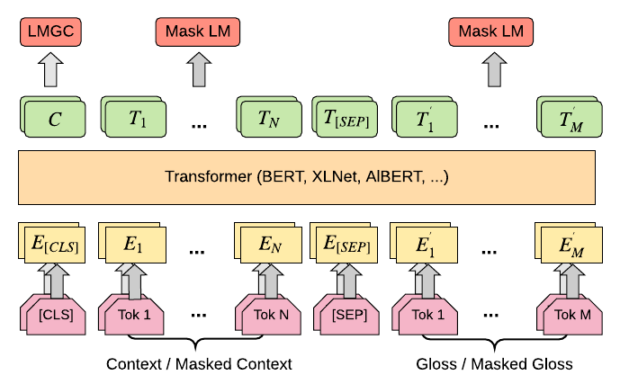

<div align="center">    
 
# Incorporating Word Sense Disambiguation in Neural Language Models

[](https://arxiv.org/abs/2106.07967)
[](https://huggingface.co/jpwahle/t5-word-sense-disambiguation)
[]()

</div>

This repository is the official implementation of the paper ["Incorporating Word Sense Disambiguation into Neural Language Models"](https://arxiv.org/abs/2106.07967) using [pytorch_lightning](https://github.com/PyTorchLightning/pytorch-lightning) and the [huggingface transformers API](https://github.com/huggingface/transformers).

>📋  For quick reference, you can cite this paper with the following BiBTex.

```
@article{wahle2021incorporating,
  title={Incorporating Word Sense Disambiguation in Neural Language Models},
  author={Wahle, Jan Philip and Ruas, Terry and Meuschke, Norman and Gipp, Bela},
  journal={arXiv preprint arXiv:2106.07967},
  year={2021}
}
```
<div align="center">    
 
 [](https://arxiv.org/abs/2106.07967)

</div>
 
## Requirements

First make sure you installed this repo as a package is installed: 

```
pip install -e .
```

To install requirements:

```
pip install -r requirements.txt
```

## Data Preperation
You can either download the pre-processed dataset [here](https://drive.google.com/file/d/1OA-Ux6N517HrdiTDeGeIZp5xTq74Hucf/view?usp=sharing), OR download the original dataset of [Raganato et al.](http://lcl.uniroma1.it/wsdeval/) and [WordNet 3.0](https://wordnet.princeton.edu) to pre-process it with the scripts of [here](https://github.com/HSLCY/GlossBERT/blob/master/preparation.sh). Put the dataset into `$YOUR_DATA_DIR`, and if you chose to reconstruct the dataset, organize it in the following way
```
$YOUR_DATA_DIR
├── examples
│   ├── semcor_train_token_cls.csv
│   ├── ALL_test_token_cls.csv
│   ├── semeval2007_test_token_cls.csv
│   └── ...
├── gold_keys
│   ├── ALL.gold.key.txt
│   ├── semeval2007.gold.key.txt
│   └── ...
```


## Training & Evaluation

To train the language models in the paper, run this command:

```bash
# module folder
cd project

# run module  
python3 main.py --model_name_or_path microsoft/deberta-large \
                --output_dir /root/out \
                --data_dir /root/ExtendedEWISERData \
                --max_epochs 5 \
                --fp16 \
                --do_eval \
                --do_train \
                --do_predict \
                --max_seq_length 160 \
                --batch_size 16 \
                --learning_rate 2e-5 \
                --method lmgc \
                --shuffle \
                --num_workers 16 \
                --gpus 1 \
                --eval_names ALL semeval2007 semeval2013 semeval2015 senseval2 senseval3
 
```
You can find the used `$MODELNAME`s [here](https://huggingface.co/models).
> Disclaimer: Not all models from huggingface will work with our training scheme.

`$YOUR_OUTPUT_DIR` will be created if it doesn't exist. Otherwise, there will be a new subdirectory for each model you train and versioning for each run that you perform.

Using the flag `--mlm`  if equivalent to `LMGC-M.`

> Disclaimer: This is only tested for BERT, and XLNet. To optimize results on WSD datasets, first run with --mlm and then load the pre-trained model to run LMGC or GLUE.

We evaluated GLUE with the [official scripts](https://github.com/huggingface/transformers/blob/v3.2.0/examples/text-classification/run_pl_glue.py) from huggingface for the version 3.2.0.

## Pre-trained Models

You can download pretrained models here:

- [Huggingface Hub](https://huggingface.co/jpwahle).

## Results

Our model achieves the following performance:

### SemCor
| Dataset | Noun   | Verb   | Adj. | Adv. | Total | Pos. | Neg. |
|---|---|---|---|---|---|---|---|
SemCor  | 87k | 88.3k | 31.7k   | 18.9k | 226k | 226.5k | 1.79m|
SE2     | 1k | 517 | 445 | 254 | 2.3k | 2.4k | 14.2k
SE3     | 900 | 588 | 350 | 12 | 1.8k | 1.8k | 15.3k
SE7    | 159 | 296 | 0 | 0  | 455 | 459 | 4.5k
SE13    | 1.6k | 0 | 0 | 0 | 1.6k | 1.6k | 9.7k
SE15    | 531     | 251     | 160       | 80 | 1k | 1.2k | 6.5k

### GLUE
| | MNLI | QQP | QNLI | SST-2 | CoLA | STS-B | MRPC | RTE|
|---|---|---|---|---|---|---|---|---|
Words (Train) | 11.6m | 8.1m | 3.8m | 633k | 65k | 114k | 160k | 130k
Polysemous (Train) | 5.2m | 3.5m | 1.4m | 366k | 23k | 51k | 65k | 50k
Relation (Train) (\%) | 44.5| 42.9 | 37.7 | 57.8 | 35.5 | 44.9 | 40.9 | 39.0
Words (Test) | 286k | 893k | 205k | 17k | 8k | 34k | 17k | 14k
Polysemous (Test) | 126k	| 382k | 78k | 9k | 2k | 15k | 7k | 5k
Relation (Test) (\%) | 44.2 | 42.8 | 8.2 | 54.1 | 34.7 | 46.4 | 41.9 | 38.7


### LMGC
| System | SE07 | SE2 | SE3 | SE13 | SE15 | All |
|---|---|---|---|---|---|---|
BERT | 71.9 | 77.8 | 74.6 | 76.5 | 79.7 | 76.6
RoBERTa | 69.2 | 77.5 | 73.8 | 77.2 | 79.7 | 76.3
DistilBERT | 66.2 | 74.9 | 70.7 | 74.6 | 77.1 | 73.5 
AlBERT | 71.4 | 75.9 | 73.9 | 76.8 | 78.7 | 75.7
BART | 67.2 | 77.6 | 73.1 | 77.5 | 79.7 | 76.1
XLNet | **72.5** | **78.5** | **75.6** | **79.1** | **80.1** | **77.2**
ELECTRA | 62.0 | 71.5 | 67.0 | 73.9 | 76.0 | 70.9 

### State-of-the-art
| System | SE07 | SE2 | SE3 | SE13 | SE15 | All |
|---|---|---|---|---|---|---|
GAS |  - | 72.2 | 70.5 | 67.2 | 72.6 | 70.6
CAN |  - | 72.2 | 70.2 | 69.1 | 72.2 | 70.9
HCAN | - | 72.8 | 70.3 | 68.5 | 72.8 | 71.1
LMMS$_{BERT}$ | 68.1 | 76.3 | 75.6 | 75.1 | 77.0 | 75.4 
GLU | 68.1 | 75.5 | 73.6 | 71.1 | 76.2 | 74.1
GlossBERT | 72.5 | 77.7 | 75.2 | 76.1 | 80.4 | 77.0
BERT$_{WSD}$ | - | 76.4 | 74.9 | 76.3 | 78.3 | 76.3 
KBERT-W+W | - | - | - | - | - | 75.1
LMGC (BERT) | 71.9 | 77.8 | 74.6 | 76.5 | 79.7 | 76.6
LMGC-M (BERT) | 72.9 | 78.2 | 75.5 | 76.3 | 79.5 | 77.0
LMGC(XLNet) | 72.5 | 78.5 | 75.6 | 79.1 | 80.1 | 77.2
LMGC-M (XLNet) | **73.0** | **79.1** | **75.9** | **79.0** | **80.3** | **77.5**

### BASE vs. LARGE model
| System | SE2 | SE13 | All |
|---|---|---|---|
| BERT$_{BASE}$ | 77.78 | 76.52 | 76.59
| BERT$_{LARGE}$ | 78.26 | 76.46 | 76.67

### GLUE Results
| System | CoLA | SST-2 | MRPC | STS-B | QQP | MNLI | QNLI | RTE | - |
|---|---|---|---|---|---|---|---|---|---|
BERT$_{BASE}$ | 52.1 | 93.5 | **88.9** | 85.8 | 89.3 | 84.6/83.4 | **90.5** | 66.4 | 79.6  
GlossBERT | 32.8 | 90.4 | 75.2 | 90.4 | 68.5 | 81.3/80 | 83.6 | 47.3 | 70.7 
LMGC (BERT) | 31.1 | 89.2 | 81.9 | 89.2 | 87.4 | 81.4/80.3 | 85.4 | 60.2 | 74.5 
LMGC-M (BERT) | **55.0** | **94.2** | 87.1 | **88.1** | **90.8** | **85.3/84.2** | 90.1 | **69.7** | **82.5**

## Imports
This project is setup as a package which enables importing submodules in the following way:
```python
from project.data import WSDDataset
from project.model import WSDFinetuner
from pytorch_lightning import Trainer

# model
model = WSDFinetuner(args)
trainer = pl.Trainer.from_argparse_args(args)

# datasets
train_dataset = WSDDataset(args, dataset_name="train")
val_dataset = WSDDataset(args, dataset_name="semeval2013")
test_dataset = WSDDataset(args, dataset_name="senseval2")

# train, val & test
trainer.fit(model, DataLoader(train_dataset), DataLoader(val_dataset))
trainer.test(model, DataLoader(test_dataset))
```

## Citation   
```
@article{wahle2021incorporating,
  title={Incorporating Word Sense Disambiguation in Neural Language Models},
  author={Wahle, Jan Philip and Ruas, Terry and Meuschke, Norman and Gipp, Bela},
  journal={arXiv preprint arXiv:2106.07967},
  year={2021}
}
```
